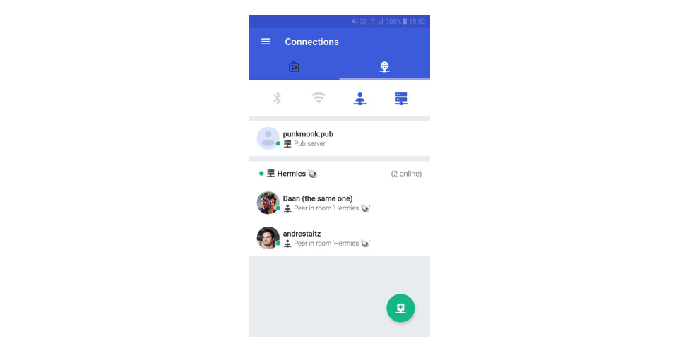

# SSB Room 🏕

**A server to find and connect to other SSB peers – a meeting place.**

- A [Secure Scuttlebutt (SSB)](https://www.scuttlebutt.nz) server for your community
- Friends currently online can connect to each other, bridged by the room server
- No developer skills required to set up your own room
- Comes with a friendly web page interface

## How does this compare to SSB pubs?

SSB [*Pubs*](https://www.scuttlebutt.nz/concepts/pub) are servers that hold copies of several SSB accounts, allowing you to sync with multiple friends, even if those friends are not currently online. *Rooms* are alternatives to Pubs that have an important difference: rooms **do not store any user data**, but instead allow **currently online friends to connect to each other** and synchronize their feeds.

The advantages are:

- Discover accounts that share a common interest with you
- Choose who you want to connect with (helps avoid a sudden influx of many strangers)
- Openly available invites makes it easy to onboard people onto SSB
- No concerns about hosting other people's data on the internet

The caveat is that you can only connect with accounts that are currently online in the same room. That said, you can still fetch the updates of an offline friend if another account online in the room also follows that offline friend.

### ℹ️ [Read more in our FAQ](./FAQ.md) and [announcement blog post](https://www.manyver.se/blog/announcing-ssb-rooms)

## How to setup an SSB room

1. Create an account on [DigitalOcean](https://www.digitalocean.com/) and setup a billing method

2. Press this button  to create a server on DigitalOcean and setup SSB Room

3. Follow the instructions on that page until you see this big button, and press it. "Go to your new app!"

4. You will see this initial page. Setup a name and description for your room server, and press "Done".

5. In the next page, your room is now ready to be used. It shows the invite code.

6. **Copy the invite code and paste it** into your preferred SSB app. Apps that support room invite codes: Manyverse (version 0.1908.12 or higher) and Patchwork.

7. In your SSB app, when friends join the room, your apps will sync. Send the room's website link to other friends to invite them too.

8. Announce the room's website publicly to the world by mentioning it anywhere on the web with the hashtag `#ssbroom`, or keep the link private to yourself and your friends.

For other use cases and setups, [read the FAQ](./FAQ.md).

## Acknowledgements and donations

A large portion of this project was forked from ahdinosaur's superb [ssb-pub](https://github.com/ahdinosaur/ssb-pub). Support them on their [OpenCollective](https://opencollective.com/sunrise-choir).

As for myself, you can support my work on the [Manyverse OpenCollective](https://opencollective.com/manyverse).

## License

AGPL-3.0
