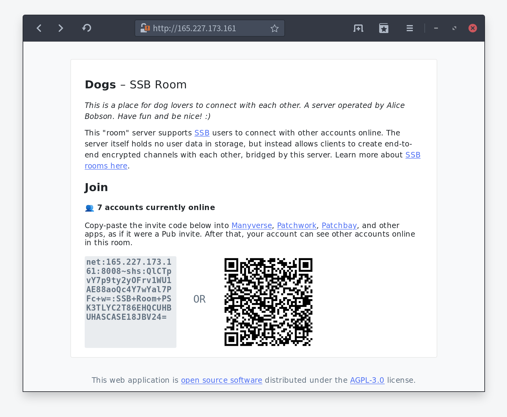
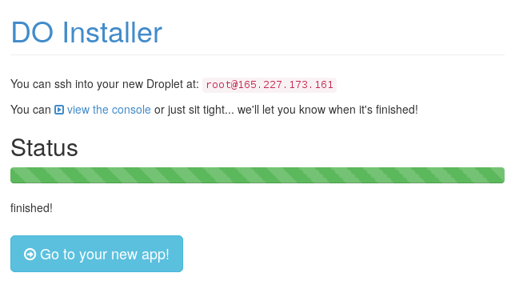
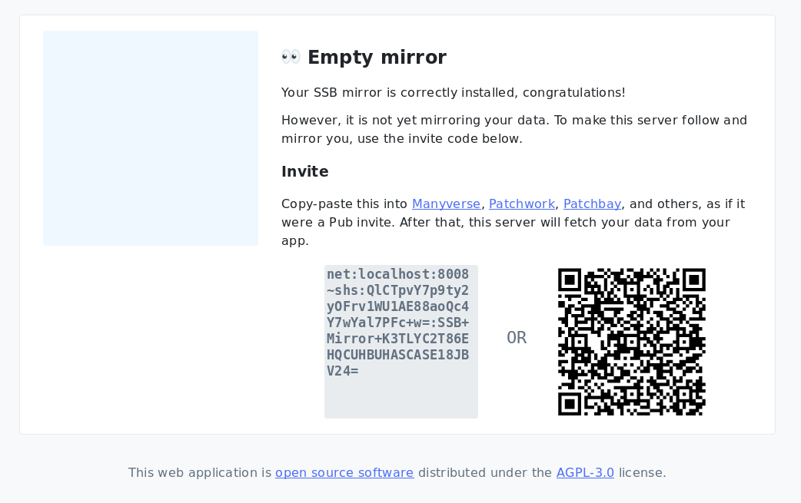
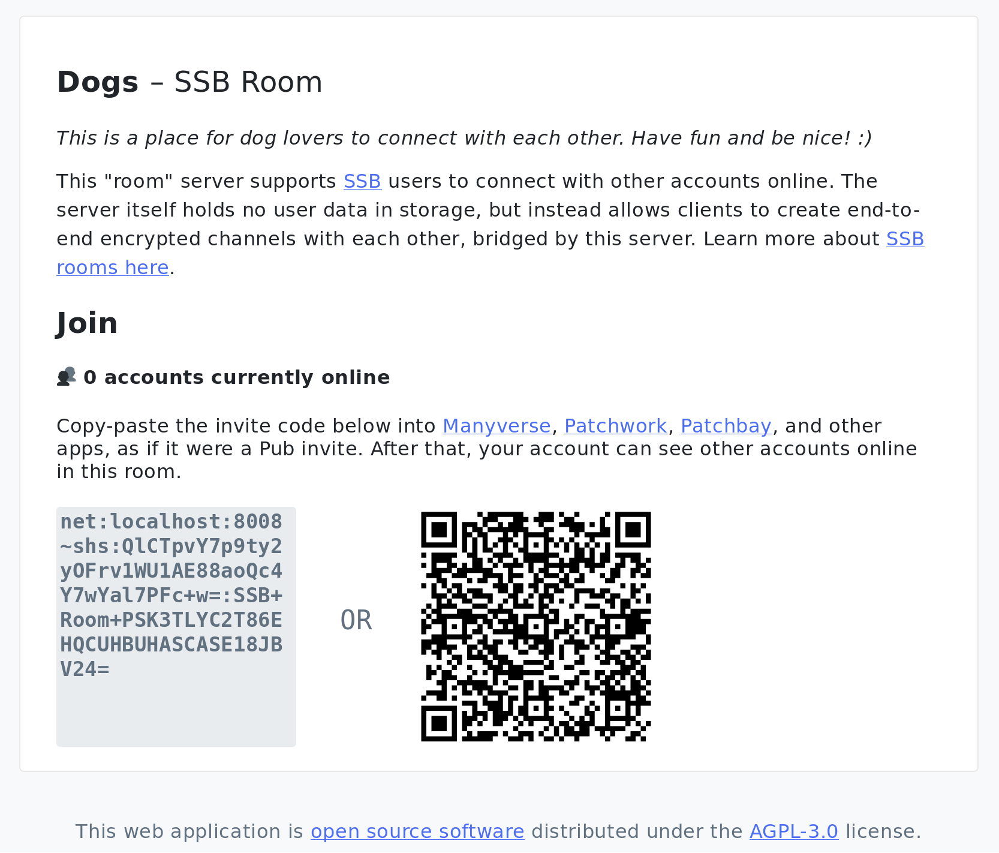

# SSB Spot

**A server to find and connect to other SSB peers – a meeting spot.**

- Your own [Secure Scuttlebutt (SSB)](https://www.scuttlebutt.nz) server to mirror your data
- No developer skills required! Clicking on websites is enough to set this up
- Comes with a friendly web page interface

SSB [*Pubs*](https://www.scuttlebutt.nz/concepts/pub) are servers that hold copies of several SSB accounts, allowing you to sync with multiple friends. *Mirrors* are alternatives to Pubs that have an important difference: a mirror contains data for **only your account**, and **anyone can get an invite** to replicate your public data.

The advantages are:

- Quicker sync if people are interested in getting only your data
- Open invites makes it easy to onboard people onto SSB
- No concerns about hosting other people's data
- Lightweight server to run and maintain, because it holds only your data

The disadvantages are:

- It is unidirectional (people get your data but you won't get theirs, unless you follow their mirror or have a pub in common)
- New users onboarding SSB with just your data will still have to reach out for more data from other community members, to have a meaningful interaction

I recommend you try out setting up your own mirror, the more mirrors there are, the easier it will be to get in contact with everyone on the network!

## How to setup your mirror

### The easy way

1. Create an account on [DigitalOcean](https://www.digitalocean.com/) and setup a billing method

2. Press this button  to create a server on DigitalOcean and setup SSB Mirror

3. Follow the instructions on that page until you see this big button, and press it. "Go to your new app!"

4. You will see this "empty" page. Copy the invite code and paste it into your SSB app

5. Wait a bit for the server to fetch your data

6. Refresh the page:

7. Done! Now you can tell the whole world to visit this page and they can get that invite code to sync with your data

### Adding a domain name

In case you want to have a custom domain address for that page, such as `ssb.staltz.com` instead of a raw IP address, you need to (1) own a domain (there are many providers for this), (2) setup DNS to add an `A` record pointing to the IP address you got from DigitalOcean.

### The custom way

[Read here](./manual-setup.md) on how to setup a mirror manually, using Docker containers on your preferred server provider.

## Acknowledgements

A large portion of this project was forked from ahdinosaur's superb [ssb-pub](https://github.com/ahdinosaur/ssb-pub). Support them on their [OpenCollective](https://opencollective.com/sunrise-choir).

As for myself, you can support my work on the [Manyverse OpenCollective](https://opencollective.com/manyverse).

## License

AGPL-3.0
